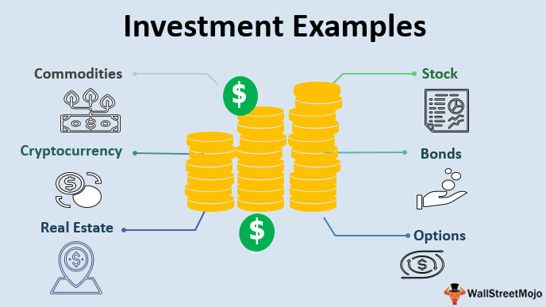

# InvestmentCaseStudy

## Problem Statement

Spark Funds, an asset management company wants to make investments in a few companies. They want to understand the global trends in investments so that they can take the investment decisions effectively.

## Business objective

The objective is to identify the best sectors, countries, and a suitable investment type for making investments. The overall strategy is to invest where others are investing, implying that the 'best' sectors and countries are the ones 'where most investors are investing'.

## Goals of data analysis

1. Investment type analysis: Comparing the typical investment amounts in the venture, seed, angel, private equity etc. so that Spark Funds can choose the type that 
                             is best suited for their strategy.

2. Country analysis: Identifying the countries which have been the most heavily invested in the past.

3. Sector analysis: Understanding the distribution of investments across the eight main sectors. 

